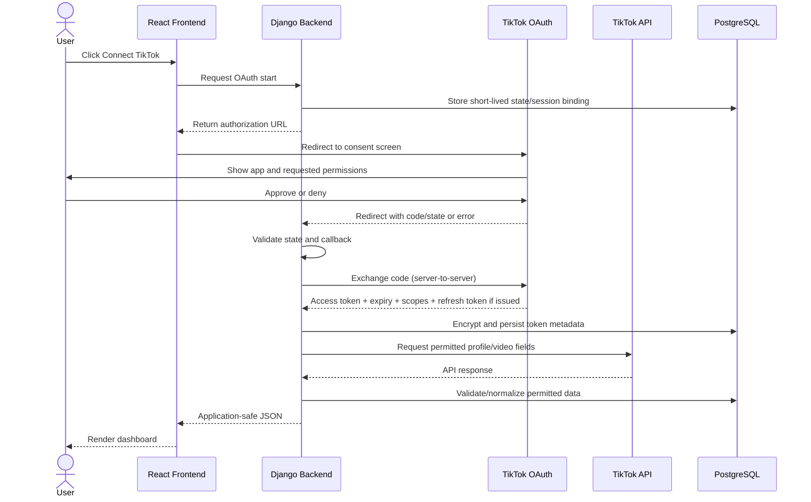
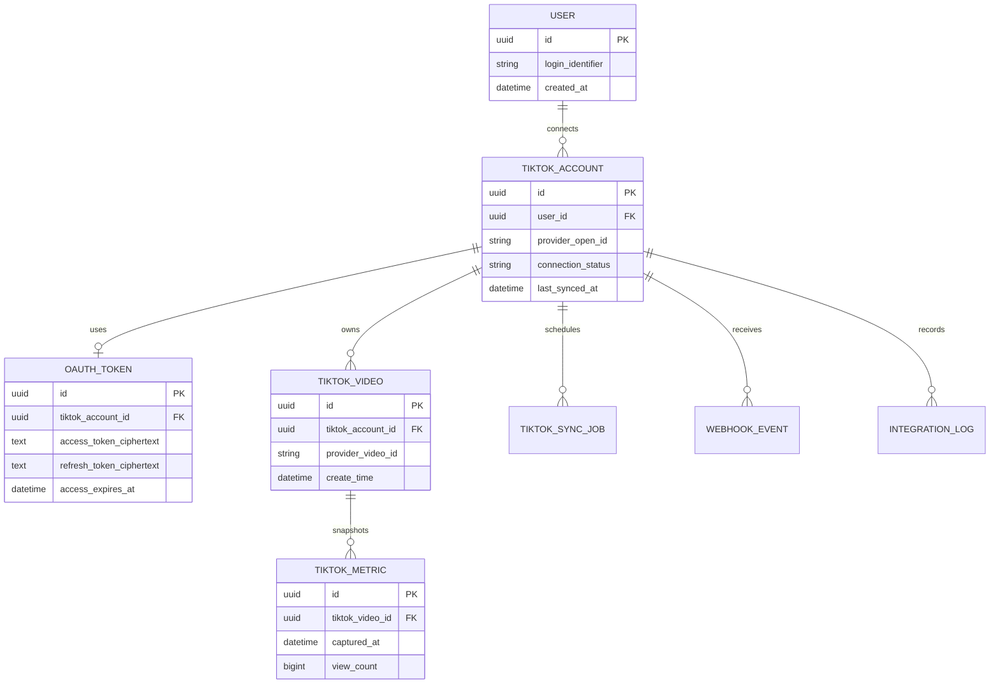

# TikTok API Capability Analysis

> **Purpose:** Determine which TikTok capabilities a third-party web application can legitimately use, what requires user authorization or app approval, and how to design a secure, platform-independent integration.
>
> **Prepared:** 8 October 2026  
> **Status:** Engineering planning document; verify live developer-portal settings and current terms before production.  
> **Scope:** Publicly documented TikTok developer products. This is not legal advice and does not imply that any particular app has been approved.

## Executive summary

The smallest credible product is a **Social Content Intelligence Dashboard** built with React, Django REST Framework, and PostgreSQL. Its initial scope should be limited to connecting a TikTok account, retrieving permitted profile information and the user's permitted video data through Login Kit and the Display API, and presenting that data with refresh, loading, error, and reconnect states.

TikTok does **not** provide a universal API that grants unrestricted access to every public profile, private account, direct message, follower list, audience demographic, or native analytics screen. Data being visible in the TikTok app or website does not mean it is exposed through a public developer endpoint, that your app is approved to retrieve it, or that you may store and redistribute it.

**Recommended rule:** implement only capabilities supported by the current official API documentation, the app's approved products/scopes, the individual user's consent, and applicable terms. Keep TikTok-specific behavior behind a backend integration layer so core CRM and business workflows remain useful if TikTok access changes.

### Capability labels used in this document

- **AVAILABLE:** A documented public developer capability exists, subject to its normal setup and use requirements.
- **USER-AUTHORIZED:** Requires a user to grant the relevant permission and the application to use an approved product/scope.
- **APPROVAL / AUDIT:** Requires an app review, product access approval, audit, or eligibility review as specified by that product.
- **LIMITED / UNCERTAIN:** Only specific fields, use cases, users, or product configurations are supported; verify the exact requirement.
- **NOT IDENTIFIED:** No public official endpoint was identified in the reviewed documentation. This is not proof that no private partnership or separately contracted product exists.

## 1. Business requirements and feasibility

| Business goal               | User story                                         | Required TikTok capability                         | Required data                                              | API dependency                        | Feasibility                                   |
| --------------------------- | -------------------------------------------------- | -------------------------------------------------- | ---------------------------------------------------------- | ------------------------------------- | --------------------------------------------- |
| Connect an account          | As a creator, I want to authorize my account       | OAuth / Login Kit                                  | User identity and granted scopes                           | Login Kit                             | AVAILABLE with setup and consent              |
| Show connected profile      | I want to see which account is connected           | User info                                          | Approved profile fields                                    | Display API                           | USER-AUTHORIZED                               |
| Show my videos              | I want to browse my permitted videos               | Video list/query                                   | Video IDs, descriptions, dates, permitted URLs and metrics | Display API                           | USER-AUTHORIZED; field-specific               |
| Refresh data                | I want to update the dashboard                     | Repeated authorized API calls                      | Latest permitted response                                  | Display API                           | AVAILABLE within quota                        |
| Explain content performance | I want to compare supported counters               | Video fields exposed by the API                    | Available counts and dates                                 | Display API                           | LIMITED; do not assume all analytics exist    |
| Read any creator's videos   | I want to analyze arbitrary accounts               | Public-content discovery/search                    | Public content metadata                                    | Product-specific API                  | LIMITED; no general Display API entitlement   |
| Read DMs                    | I want to see TikTok conversations in my CRM       | Messaging access                                   | Message content and metadata                               | No public general endpoint identified | NOT IDENTIFIED                                |
| Publish videos              | I want to publish from my app                      | Content Posting API                                | Media and publishing settings                              | Content Posting API                   | USER-AUTHORIZED; app review/audit constraints |
| Track leads                 | I want to follow up with prospects                 | Internal CRM workflow                              | Contact, stage, activity, tasks                            | Your backend/database                 | NOT TECHNICALLY DEPENDENT on TikTok           |
| Attribute bookings/revenue  | I want to connect marketing with business outcomes | Internal event tracking plus permitted social data | Leads, source, bookings, revenue                           | Your backend/database                 | Build primarily with first-party data         |

### Requirement priority

- **MUST HAVE:** OAuth connection, permitted profile/video reads, server-side token handling, useful dashboard, refresh, errors, disconnect.
- **NICE TO HAVE:** pagination, cached responses, last-sync indicator, metric snapshots, reconnect guidance.
- **OPTIONAL:** content publishing, additional social providers, AI summaries, background sync.
- **NOT TECHNICALLY NECESSARY:** TikTok DMs, arbitrary audience surveillance, private data, follower-level scraping, or TikTok access for core CRM/booking workflows.

The MVP is successful if it creates value from a narrow, documented capability. It should not depend on obtaining every kind of TikTok data.

## 2. Relevant TikTok developer products

| Product                           | Purpose and likely use                                                     | Authorization / approval                                                        | Important limitations                                                              |
| --------------------------------- | -------------------------------------------------------------------------- | ------------------------------------------------------------------------------- | ---------------------------------------------------------------------------------- |
| **Login Kit**                     | Let users sign in/connect using TikTok identity and consent flow           | Developer app setup, redirect configuration, applicable scopes and user consent | Login does not grant all TikTok data                                               |
| **Display API**                   | Retrieve permitted profile information and a user's videos                 | Relevant scopes and user authorization; app/product configuration applies       | Not a general search API for all creators; only documented fields                  |
| **Content Posting API**           | Upload/direct-post or support posting workflows                            | Relevant scope, user authorization, app review/audit and product requirements   | Publishing modes, UX, media constraints, and audit status matter                   |
| **Research API / Research Tools** | Eligible researchers access specified public data for approved research    | Eligibility and separate application/approval                                   | Not a general commercial CRM or creator-marketing API                              |
| **TikTok Business API**           | Business/advertising integrations such as campaign and reporting workflows | Business account, app/product access and advertiser permissions                 | Separate from consumer Display API; advertiser data is not automatically available |
| **Data Portability API**          | Eligible portability/transfer use cases                                    | Product eligibility, consent and applicable requirements                        | Not a generic back door to all private data                                        |
| **Webhooks**                      | Receive supported event notifications where a product documents them       | Product-specific event setup and access                                         | Do not assume general social-content, DM, or metric webhooks exist                 |
| **Other specialized products**    | Product-specific use cases listed in the developer portal                  | Varies by product                                                               | Validate current eligibility and exact scope before committing to a feature        |

**Recommendation:** use Login Kit plus Display API for Project 1. Add Content Posting API only if publishing becomes a validated requirement. Do not use Research API as a shortcut for a commercial analytics product; its eligibility and purpose are different. Use Business API only when the product genuinely needs authorized advertising workflows.

## 3. Endpoint and capability map

The paths below are the documented paths identified for the relevant core capabilities. Confirm current version, required fields, request format, and app entitlements in official docs before implementation.

### A. Account/profile

| Endpoint                         | Method       | Purpose                                                             | Scope / authorization                                                                   | Approval / limitations                                             |
| -------------------------------- | ------------ | ------------------------------------------------------------------- | --------------------------------------------------------------------------------------- | ------------------------------------------------------------------ |
| `/v2/user/info/`                 | GET          | Read selected fields for the authorized user                        | `user.info.basic`; additional profile/statistics fields require their respective scopes | User consent; field access depends on scopes and app configuration |
| Login Kit authorization endpoint | GET/redirect | Begin authorization                                                 | Requested scopes and user consent                                                       | Redirect URI must match configuration                              |
| `/v2/oauth/token/`               | POST         | Exchange code or refresh token                                      | App credentials and valid grant parameters                                              | Backend only; protect client secret and tokens                     |
| `/v2/oauth/revoke/`              | POST         | Revoke a token where supported by the current token-management flow | Valid token/request parameters                                                          | Follow current OAuth documentation                                 |

### B. User's own content

| Endpoint            | Method          | Purpose                                                                            | Scope / authorization                            | Approval / limitations                                     |
| ------------------- | --------------- | ---------------------------------------------------------------------------------- | ------------------------------------------------ | ---------------------------------------------------------- |
| `/v2/video/list/`   | POST            | List videos for the authorized user                                                | `video.list`                                     | User consent; documented pagination and field restrictions |
| `/v2/video/query/`  | POST            | Query specified videos and supported fields                                        | `video.list` for the documented Display API flow | Only eligible/accessible video IDs and documented fields   |
| Video Object fields | Response schema | May include ID, description, creation time, cover/share URL and supported counters | Scope and requested `fields` determine output    | Never assume a field exists unless documented and returned |

### C. Public content

**No general Display API endpoint identified for arbitrary public-video search or unrestricted public profile crawling.** TikTok's website displaying content does not create an API entitlement. Research API is a separate restricted product for eligible research use; it must not be treated as a general commercial discovery API.

### D. Publishing

| Endpoint/capability                       | Method                  | Purpose                                    | Authorization / approval                                        | Limitations                                                                    |
| ----------------------------------------- | ----------------------- | ------------------------------------------ | --------------------------------------------------------------- | ------------------------------------------------------------------------------ |
| Content Posting API upload initialization | POST                    | Start a supported upload workflow          | `video.upload` or relevant current posting scope; user consent  | Product-specific upload rules and media requirements                           |
| Content Posting API direct post           | POST                    | Publish content through supported workflow | `video.publish` or relevant current posting scope; user consent | App review/audit, creator UX, visibility settings and other requirements apply |
| Publish status/fetch operations           | Product-defined methods | Check status of an initiated publish       | Same product authorization                                      | Use exact current endpoint documentation; do not invent paths                  |

Publishing endpoint paths and request bodies can vary by workflow. Follow the current Content Posting API documentation instead of copying an old tutorial.

### E. Analytics / insights

The Display API may return certain video counters in documented video fields. **No general public endpoint identified for all native creator analytics**, historical trend charts, audience retention graphs, full reach data, audience demographics, or arbitrary-account analytics. Separate Business API reporting applies to eligible advertising data and is not a substitute for creator analytics.

### F. Comments

**No public official general endpoint identified in the reviewed core Display API documentation for reading or managing all video comments and replies.** Verify any specialized product-specific capability in the current developer portal before designing a comment workflow.

### G. Messaging

**No public official general endpoint identified for reading TikTok direct messages or conversation history** in the reviewed public developer products. Do not scrape messages or bypass platform controls. Build a first-party CRM interaction log instead.

### H. Followers / following

**No public official general Display API endpoint identified for enumerating follower or following lists.** A follower count, if exposed in a permitted field, is not the same as access to individual follower identities. Research access is separately constrained.

### I. Search / discovery

**No general public commercial Display API endpoint identified for searching all TikTok users or videos.** Research API has separate eligibility and approved use restrictions. Do not infer search capability from TikTok's own application or website.

### J. Webhooks / events

TikTok documents webhooks for specific supported products and events. There is no basis to assume a general webhook exists for every new video, every metric change, DMs, followers, or audience insights. Confirm the exact event list and verification requirements for the product you use.

### K. Other relevant APIs

- **Business API:** eligible advertising accounts, campaign management, and reporting use cases.
- **Data Portability API:** product-specific portability workflows; not general unrestricted data extraction.
- **Research API:** approved research access; not a general commercial data feed.

## 4. Authentication and OAuth architecture

OAuth terms:

- **Client key / client ID:** identifies the developer application.
- **Client secret:** confidential application credential; backend only.
- **Authorization server:** TikTok system that authenticates the user and issues authorization results.
- **Redirect URI:** registered callback address.
- **Authorization code:** short-lived code exchanged by the backend.
- **Access token:** credential sent to authorized API endpoints.
- **Refresh token:** credential used to obtain a replacement access token when supported.
- **Scope:** a named permission requested by the app.
- **State:** unpredictable value tied to the user's initiating session to mitigate forged callbacks.
- **PKCE:** proof-key extension used when supported/required by the chosen OAuth flow. Verify TikTok's current Login Kit requirements; do not assume every TikTok web flow uses PKCE identically.
- **App approval:** TikTok's product/scope review; separate from a user's consent.
- **Revocation:** invalidating authorization; handle both user-initiated disconnect and provider-side revocation.

### OAuth sequence



### Token lifecycle

- Persist tokens only server-side; encrypt sensitive token values at rest and restrict access.
- Record expiry and granted scopes. Refresh before expiry with a small safety margin when supported.
- If refresh returns replacement token material, persist it atomically.
- Handle `401`/invalid-token responses by attempting only a valid documented refresh flow, then require reconnection if necessary.
- Handle `403`/insufficient-scope responses as permission/product issues, not endless retries.
- On disconnect, stop scheduled sync, revoke authorization when supported, delete or quarantine tokens, and apply documented retention/deletion rules to stored data.
- A TikTok password change's effect on existing app authorization is not assumed; react to actual revocation/invalid-token responses and follow official documentation.
- If a token leaks: revoke where possible, rotate affected secrets, investigate logs, invalidate sessions as appropriate, and notify affected parties under the incident policy.

## 5. Scope matrix

Scopes are permissions requested by an app; they are not endpoints and do not guarantee app approval.

| Scope                    | General purpose                                           | Does not grant                                                              | User consent / approval                               | Relevance               |
| ------------------------ | --------------------------------------------------------- | --------------------------------------------------------------------------- | ----------------------------------------------------- | ----------------------- |
| `user.info.basic`        | Basic authorized profile information                      | Arbitrary-user private data, DMs, all analytics                             | User consent; product/app setup applies               | MUST HAVE               |
| `user.info.profile`      | Additional documented profile fields                      | Any undocumented field or private platform data                             | User consent and applicable app requirements          | NICE TO HAVE            |
| `user.info.stats`        | Supported user statistics fields                          | Full native analytics or audience demographics unless explicitly documented | User consent and applicable app requirements          | OPTIONAL                |
| `video.list`             | List/query authorized user's videos and documented fields | Universal public video search, private data from other users                | User consent and applicable app requirements          | MUST HAVE               |
| `video.upload`           | Supported upload workflow                                 | Permission to publish every video without the relevant flow/consent         | User consent and product requirements                 | OPTIONAL                |
| `video.publish`          | Supported publishing workflow                             | Unrestricted account control or silent publishing outside requirements      | User consent; app review/audit may apply              | OPTIONAL                |
| Business API permissions | Authorized advertiser/campaign workflows                  | Consumer creator data for arbitrary accounts                                | Business/app permissions and advertiser authorization | Separate future product |
| Research API access      | Approved research datasets/endpoints                      | General commercial access                                                   | Eligibility and research approval                     | Not MVP                 |

**Verify scope names against the live scope reference when registering the app.** TikTok may change product names, scopes, field availability, or review requirements.

### Distinctions that must remain clear

1. **Scope:** what permission the app asks for.
2. **Endpoint:** a documented URL and method.
3. **User authorization:** an individual user grants access.
4. **App review/approval:** TikTok authorizes the app/product/use case.
5. **Field selection:** a request may need to explicitly ask for documented fields.
6. **Quota:** how much or how often an approved capability can be used.

All applicable conditions must be satisfied.

## 6. Data availability matrix

Status key: **Public** = visible on TikTok, but API entitlement still must be established; **Authorized** = potentially returned for a consenting user; **Private/restricted** = not generally available; **Unavailable** = no public official endpoint identified for the proposed general use.

| Data type                                         | Publicly accessible?                                 | User authorization?                         | API / scope                                              | Store in DB?                               | Redistribute?                                    | Notes                                              |
| ------------------------------------------------- | ---------------------------------------------------- | ------------------------------------------- | -------------------------------------------------------- | ------------------------------------------ | ------------------------------------------------ | -------------------------------------------------- |
| Username                                          | May be publicly visible                              | Depends on endpoint                         | Basic profile fields where documented                    | Only if permitted and necessary            | Not automatically                                | Verify exact field and identifier semantics        |
| Display name                                      | Often visible                                        | Yes for authorized profile endpoint         | `user.info.basic`                                        | Subject to terms                           | Not automatically                                | Use minimum data                                   |
| Avatar                                            | Often visible                                        | Authorized endpoint/field                   | Basic profile field where documented                     | Subject to terms                           | Not automatically                                | URLs may expire/change                             |
| Bio                                               | May be visible                                       | Additional profile scope may apply          | `user.info.profile` if documented                        | Subject to terms                           | Not automatically                                | Field availability matters                         |
| Account ID                                        | Not a public universal identifier                    | Authorized API returns its documented ID    | Basic scope / API response                               | Store provider ID carefully                | No unrestricted redistribution assumption        | Treat as external identifier                       |
| Verification status                               | May be visible in UI                                 | No general supported field identified       | Not identified in core Display API                       | No, unless supported source exists         | No                                               | Do not infer from UI scraping                      |
| Authorized user's videos                          | Public/private visibility rules still apply          | Yes                                         | `video.list`                                             | Subject to policy/retention                | Not automatically                                | Only API-returned accessible items                 |
| Caption/description                               | Public for public content                            | Authorized user's video endpoint            | Video fields                                             | Subject to terms                           | Not automatically                                | Treat as untrusted text                            |
| Hashtags                                          | May be embedded in description                       | No separate general endpoint identified     | Parse only permitted returned description if appropriate | Subject to policy                          | Not automatically                                | Avoid assuming separate hashtag analytics          |
| Music/sound metadata                              | Sometimes visible                                    | No general field guaranteed                 | Verify video schema                                      | Only if permitted                          | Not automatically                                | Do not infer undocumented metadata                 |
| Video URL / thumbnail                             | May be public or temporary                           | Returned field where available              | Documented video fields                                  | Cache cautiously                           | Not automatically                                | URLs may expire or be access-limited               |
| Creation date                                     | May be visible                                       | Authorized video response                   | `video.list` / video object                              | Subject to terms                           | Not automatically                                | Normalize timestamp                                |
| Views / likes / comments / shares                 | Some counters may be exposed                         | Authorized endpoint and field               | Documented video fields                                  | Subject to terms                           | Not automatically                                | Not equivalent to full analytics                   |
| Saves/favorites                                   | No general field identified                          | N/A                                         | No general endpoint identified                           | No basis to store via API                  | No                                               | Do not infer availability                          |
| Engagement rate                                   | Derived metric                                       | Requires permitted component metrics        | Your calculation                                         | Yes, if inputs/use are permitted           | Your policy governs but source terms still apply | Label formula and missing data                     |
| Followers count                                   | May be visible; field availability is scope-specific | Scope where documented                      | Verify current user schema                               | Subject to terms                           | Not automatically                                | Not a follower list                                |
| Following count/list                              | No general list endpoint identified                  | Not generally available through Display API | No general endpoint identified                           | No                                         | No                                               | Do not scrape                                      |
| Audience demographics/interests/location/activity | Some native analytics may show these                 | No general Display API endpoint identified  | No general endpoint identified                           | No API basis                               | No                                               | Do not promise this feature                        |
| Comment text/authors/replies/likes                | Publicly visible in app may not imply API access     | No general core endpoint identified         | No general endpoint identified                           | No API basis                               | No                                               | Use manual/internal notes if appropriate           |
| DMs/conversation history                          | Private                                              | No general endpoint identified              | None identified                                          | No                                         | No                                               | Do not scrape or request passwords                 |
| LIVE viewers/comments/analytics                   | May appear in TikTok product UI                      | No general public endpoint identified       | None identified in core Display API                      | No API basis                               | No                                               | Verify specialized official product before scoping |
| Ad accounts/campaigns/performance                 | Business data                                        | Business account/app authorization          | Business API                                             | Under applicable terms                     | Not automatically                                | Separate from consumer Display API                 |
| Deleted content                                   | Not reliably available                               | No general recovery endpoint identified     | None identified                                          | Previously retained data subject to policy | Not automatically                                | Define deletion/retention rules                    |
| Public arbitrary creator data                     | Some content visible publicly                        | Depends on a specific authorized product    | No general Display API search                            | Not by default                             | Not automatically                                | Research API is restricted                         |

### Public is not synonymous with accessible or reusable

A field can be visible in TikTok's UI yet not be exposed by an API. An API may return a field only for a user who has authorized the app. Even when an API returns data, storage, retention, commercial use, and redistribution remain subject to applicable product terms and privacy obligations.

## 7. Backend request design

```text
React UI
   │ HTTPS + app session
   ▼
Django REST API
   ├── authenticate app user
   ├── authorize tenant/account ownership
   ├── validate request
   ├── call TikTok integration service
   ├── normalize and validate response
   └── return application-safe JSON
           │
           ▼
      TikTok API
           │
           ▼
     PostgreSQL (optional persisted data)
```

### Frontend responsibilities

- Display connection state, data, loading, empty, and error states.
- Send application requests to Django, not directly to TikTok with a client secret.
- Trigger refresh and reconnect flows.
- Never store the client secret or refresh token in `localStorage`, React state, source code, or public build-time environment variables.

### Backend responsibilities

- Handle OAuth callback and token exchange.
- Keep secrets and tokens server-side.
- Enforce tenant and account ownership.
- Select fields and scopes intentionally.
- Validate provider responses and map provider errors to stable internal error codes.
- Apply timeouts, quota-aware scheduling, safe retries, and logs with secrets redacted.
- Store only data needed for the product and allowed by applicable terms.

### Reliability rules

- **Timeout:** use explicit connect/read timeouts.
- **Retry:** exponential backoff with jitter for transient failures and `429`; respect `Retry-After` when present.
- **Do not blindly retry:** publishing or other non-idempotent operations.
- **Pagination:** follow returned cursor/has-more metadata; never assume one page is complete.
- **Caching:** cache only when useful and allowed; define TTL and invalidation.
- **Rate limiting:** use a queue/token budget and stagger sync jobs.
- **Duplicate requests:** deduplicate in-flight refreshes where appropriate.
- **Webhooks:** verify using the supported product mechanism, acknowledge quickly, process asynchronously, and deduplicate event IDs when available.
- **Synchronization:** record last attempted and last successful sync; make upserts idempotent.
- **Error mapping:** distinguish authentication, insufficient permission, not found, rate limit, provider outage, and malformed response.

## 8. Minimal database model

A small MVP does not need a separate table for every potential feature. Start with a few well-defined entities and expand only when requirements demand it.

### `User`

- `id` UUID primary key
- `email` or chosen login identifier, unique as appropriate
- `created_at`, `updated_at`
- Purpose: user of your application, not TikTok identity

### `TikTokAccount`

- `id` UUID primary key
- `user_id` foreign key to `User`
- `provider_open_id` string
- `display_name`, `avatar_url` nullable
- `granted_scopes` JSON/text array
- `connection_status`
- `connected_at`, `last_synced_at`, `created_at`, `updated_at`
- Unique constraint on `(user_id, provider_open_id)`; add a provider-wide uniqueness rule only if it matches actual provider identity semantics.
- Index on `user_id`, `connection_status`

### `OAuthToken`

- `id` UUID primary key
- `tiktok_account_id` foreign key, normally one active token record per connection
- `access_token_ciphertext`, `refresh_token_ciphertext`
- `access_expires_at`, `refresh_expires_at` where provided
- `key_version`, `updated_at`
- Sensitive: all token values. Encrypt at application/service layer using a managed key; restrict database and decryption access.
- Do not log plaintext tokens.

### `TikTokVideo`

- `id` UUID primary key
- `tiktok_account_id` foreign key
- `provider_video_id` string
- `description`, `create_time`, `cover_url`, `share_url` nullable
- `last_seen_at`, `updated_at`
- Unique constraint on `(tiktok_account_id, provider_video_id)`
- Index on `(tiktok_account_id, create_time)`
- Store only fields permitted and useful for the product.

### `TikTokMetric` (optional for MVP)

- `id` UUID primary key
- `tiktok_video_id` foreign key
- `captured_at`
- Supported metric columns such as views/likes/comments/shares, nullable
- Unique constraint on `(tiktok_video_id, captured_at)` or a documented snapshot key
- Use only if permitted historical snapshots are useful; a snapshot is your observation, not an official historical metric series.

### `TikTokSyncJob` (when background sync is introduced)

- `id` UUID primary key
- `tiktok_account_id` foreign key
- `status`, `attempt_count`, `scheduled_at`, `started_at`, `finished_at`
- `last_error_code` and safe diagnostic metadata
- Index on `(status, scheduled_at)`

### `WebhookEvent` (only if a supported webhook is used)

- `id` UUID primary key
- provider event identifier where supplied
- event type, received timestamp, processing status
- minimal payload or encrypted payload if retention is justified
- Unique constraint on provider event identifier when available for deduplication

### `IntegrationLog`

- `id` UUID primary key
- account reference, operation, status, provider status/error code, duration, timestamp
- Avoid access tokens, authorization codes, client secrets, and unnecessary personal data.
- Index on `(tiktok_account_id, created_at)` and error status where useful.

### ER diagram



## 9. Security review

### Required controls

- **OAuth:** unpredictable state tied to initiating session; validate it once; use exact registered redirect URIs; protect authorization codes.
- **PKCE:** use where TikTok's current flow supports/requires it; do not assume unsupported behavior.
- **Tokens:** server-side storage, encryption at rest, access control, rotation/refresh handling, and redaction.
- **Application API:** authenticate the app user on every request and check tenant/account ownership server-side.
- **CORS:** allow only necessary origins. CORS is not authentication.
- **CSRF:** protect cookie-authenticated state-changing requests.
- **XSS:** treat captions and external text as untrusted; escape output and avoid unsafe HTML injection.
- **HTTPS:** require it in production.
- **SSRF:** do not fetch arbitrary user-provided URLs; restrict outbound destinations and validate URLs.
- **Logging:** never log secrets, authorization codes, full token responses, or unnecessary private data.
- **Webhooks:** use documented verification/authenticity controls; deduplicate and process asynchronously.
- **Privacy:** minimize fields, define retention, deletion/export processes, and disconnect behavior.
- **Backups:** encrypt, restrict access, and include retained/deleted data in the retention policy.
- **Monitoring:** track 401/403/429/5xx, refresh failures, sync lag, and unusual access patterns.

### Top 10 beginner mistakes

1. Exposing client secrets or refresh tokens in the browser.
2. Failing to validate OAuth `state`.
3. Confusing app approval with individual user consent.
4. Assuming publicly visible data is automatically available via API.
5. Failing to isolate tenants and account ownership.
6. Logging tokens or authorization codes.
7. Retrying publishing requests blindly after timeouts.
8. Mishandling refresh-token replacement or expiry.
9. Keeping data indefinitely after disconnect without checking applicable requirements.
10. Trusting external JSON without schema/type validation.

## 10. Rate limits and scale

The reviewed official Display API rate-limit documentation lists default limits of **600 requests per minute** for `/v2/user/info/`, `/v2/video/query/`, and `/v2/video/list/`, enforced using a one-minute sliding window. Excess requests can receive HTTP 429 and a rate-limit error. Verify the current official page and the quotas assigned to your app before launch; these figures should not be generalized to every TikTok product or every quota dimension.

### Planning model (illustrative, not a TikTok quota guarantee)

Assume one profile request and one video-list request per connected account per refresh cycle.

| Connected users | Calls per full refresh | Main engineering concern                                  |
| --------------: | ---------------------: | --------------------------------------------------------- |
|             100 |                    200 | Basic error handling and refresh controls                 |
|           1,000 |                  2,000 | Stagger refresh and avoid unnecessary calls               |
|          10,000 |                 20,000 | Queue throughput, backoff, caching, retry storms          |
|         100,000 |                200,000 | Scheduling windows, fairness, backpressure, observability |

Do not refresh every account simultaneously. Estimate capacity using the actual app quota, request cost, pagination, and refresh frequency. A React rendering problem is unlikely to be the first scaling bottleneck; provider quotas and synchronization orchestration are more likely.

## 11. Founder risk register

Qualitative estimates only; these are not measured TikTok statistics.

| Risk                            | Probability                | Impact       | Mitigation                                                   |
| ------------------------------- | -------------------------- | ------------ | ------------------------------------------------------------ |
| Scope/product approval rejected | Medium                     | High         | Validate use case and approval path early                    |
| Desired data not exposed        | High for broad analytics   | High         | Build only verified capabilities                             |
| Token expiry/revocation         | High over product lifetime | Medium       | Refresh safely and provide reconnect UX                      |
| Rate-limit throttling           | Medium                     | Medium/high  | Queue, cache, backoff, stagger sync                          |
| API schema/version change       | Medium                     | High         | Isolate provider code and add contract tests                 |
| Policy change                   | Medium                     | High         | Review policies periodically and keep connectors replaceable |
| Retention/redistribution issue  | Medium                     | High         | Minimize storage and verify product terms                    |
| Publishing review delays        | Medium                     | High if core | Exclude publishing from initial MVP                          |
| App suspension/access loss      | Low/medium                 | Very high    | Compliance and platform-independent core workflows           |
| Regional/product availability   | Unknown                    | High         | Verify developer-portal eligibility for target market        |
| Cross-tenant access bug         | Low if tested              | Critical     | Tenant isolation tests and server-side authorization         |
| Duplicate webhook delivery      | Expected possibility       | Medium       | Idempotency and deduplication                                |

## 12. Product feasibility

Scores are engineering judgments, not official TikTok ratings.

| Dimension             |                  Score / 10 | Reason                                                              |
| --------------------- | --------------------------: | ------------------------------------------------------------------- |
| Technical feasibility |                           8 | OAuth and basic authorized profile/video integration are documented |
| API availability      |                           7 | Display API supports the narrow MVP                                 |
| Data availability     |                           5 | Broad audience insights and private data are not generally exposed  |
| Security complexity   |                           6 | Manageable with sound backend architecture                          |
| Compliance complexity |                           7 | Consent, review, privacy and use restrictions matter                |
| Scalability           |                           7 | Feasible with scheduling, queueing and quota-aware design           |
| Product value         |                           8 | Strong if data leads to useful business actions                     |
| Platform independence | 4 for TikTok-only analytics | A TikTok-only value proposition is exposed to API changes           |
| MVP difficulty        |                           7 | Moderate; app configuration/review is an external dependency        |
| Long-term viability   |                           7 | Stronger when own workflows and first-party data are central        |

**Overall planning score: 7/10** for the narrow authorized dashboard. The broader idea of a universal analytics, audience-intelligence, and messaging platform is substantially less feasible with the identified public APIs.

## 13. What cannot be built from the identified public APIs

| Desired capability                            | Verdict                                    | Reason / alternative                                                          |
| --------------------------------------------- | ------------------------------------------ | ----------------------------------------------------------------------------- |
| Read any user's private data                  | No, not generally                          | Use only documented, authorized fields                                        |
| Read DMs/conversation history                 | No general public endpoint identified      | Maintain an internal CRM communication log                                    |
| Read another user's private videos            | No general public capability identified    | Do not bypass privacy controls                                                |
| Enumerate follower/following lists            | No general Display API endpoint identified | Do not confuse aggregate counts with identities                               |
| Read audience demographics/interests/activity | No general Display API endpoint identified | Use permitted first-party surveys or business records                         |
| Access account without authorization          | No                                         | Obtain proper authorization or use an eligible documented public-data product |
| Access TikTok internal database               | No                                         | Developer APIs expose only documented interfaces                              |
| Scrape to bypass restrictions                 | Do not build around it                     | Use official APIs and follow terms                                            |
| Recover arbitrary deleted content             | No general recovery endpoint identified    | Retain only permitted historical snapshots                                    |
| Access all private analytics                  | No general Display API endpoint identified | Use explicitly returned, authorized fields                                    |
| Modify any other user's account               | No general capability                      | Use only documented actions and consent                                       |
| Publish without authorization                 | No                                         | Use supported Content Posting API flow and permissions                        |

## 14. Legal and policy boundary checklist

This document is not legal advice. Before production, review the current official terms and product-specific requirements for:

- Developer terms and permitted use.
- API/product guidelines and review requirements.
- Privacy policy, disclosures, consent, and user rights.
- Data retention, deletion, and export.
- Storage, derived data, and redistribution.
- Commercial use and research-only restrictions.
- Automated activity and prohibited scraping.
- Publishing UX, content rules, and app audit.
- Advertising account permissions and Business API terms.
- Regional availability and applicable laws.

A permission to retrieve a field does not automatically authorize every storage, resale, redistribution, or derived-data use.

## 15. MVP and development roadmap

### MVP features

1. **Connect TikTok:** Login Kit, OAuth callback, granted scopes, secure token lifecycle, disconnect.
2. **Show permitted profile and videos:** profile summary, video list, documented fields and supported counters.
3. **Refresh reliably:** pagination, loading/empty/error states, last-sync timestamp, expiry and reconnect path.

### Technology choices

- React with `fetch`, `useState`, `useEffect`, and a small API service module.
- Django REST Framework as backend-for-frontend/API boundary.
- PostgreSQL for user, connected-account, permitted video, and sync metadata.
- No Redis/worker requirement until scheduled synchronization or load justifies it.
- No publishing, DMs, audience demographics, scraping, or AI requirement in V1.

### Roadmap

| Phase                   | Goal                                          | Definition of done                                                 |
| ----------------------- | --------------------------------------------- | ------------------------------------------------------------------ |
| 0 — API research        | Verify scopes, endpoints, approval and fields | Written capability map based on current docs                       |
| 1 — OAuth               | Secure account connection                     | State validation, code exchange, error handling                    |
| 2 — Account integration | Read permitted profile/video data             | Real authorized responses shown in React                           |
| 3 — Synchronization     | Persist permitted data                        | Idempotent upsert, pagination, sync timestamps                     |
| 4 — Core product        | Useful dashboard                              | Loading, empty, success, error and refresh states                  |
| 5 — Security            | Protect accounts and tokens                   | Encryption, tenant isolation, redacted logs, disconnect            |
| 6 — Testing             | Validate failure paths                        | OAuth denial, expiry, 401/403/429/5xx and malformed response tests |
| 7 — App review          | Obtain necessary access                       | Required app/product review or audit completed                     |
| 8 — Production          | Operate reliably                              | Monitoring, alerts, retention policy, backup and runbook           |

## 16. Platform-independent product strategy

**PREDICTION — NOT DOCUMENTED FACT:** TikTok may expand or revise its developer products, but no future capability should be treated as a current product dependency.

- Keep CRM, customer profiles, follow-up tasks, bookings, revenue records, and internal analytics independent of TikTok.
- Treat social integrations as replaceable connectors.
- Store your own first-party business events and relationship history, subject to privacy obligations.
- Attribute data to its source and timestamp; distinguish provider-reported metrics from your own calculations.
- Keep provider IDs separate from internal customer IDs.
- Use capability flags so unavailable TikTok features do not break the rest of the application.
- Aim for the core business workflows to survive loss of a provider; the TikTok analytics dashboard itself cannot retain all its value if TikTok access disappears.

**Strongest strategic opportunity:** turn permitted social signals into practical actions—follow up with a lead, improve an offer, fill a booking slot, or retain a customer. Your moat should be the workflow, domain model, customer relationship history, and business outcomes—not access to data the platform controls.

## 17. Final architect's verdict

- **TikTok ALLOWS:** documented capabilities of its public developer products, subject to their conditions.
- **TikTok ALLOWS WITH USER CONSENT:** data/actions covered by granted scopes and the approved product.
- **REQUIRES REVIEW / APPROVAL:** products/scopes for which TikTok specifies app review, product access approval, or audit; publishing and research have their own requirements.
- **DOES NOT GENERALLY PROVIDE:** unrestricted private messages, arbitrary private account data, internal database access, or a universal feed of all creator analytics through the Display API.
- **SHOULD BUILD:** a secure React + Django + PostgreSQL MVP that connects a consenting user and displays permitted profile/video data.
- **SHOULD NOT BUILD:** a product whose viability depends on scraping, undocumented endpoints, private-message access, or unrestricted follower/audience data.
- **Recommended architecture:** React → Django API → TikTok integration service → TikTok API, with PostgreSQL for permitted data and background workers only when needed.
- **Biggest risk:** the desired data or use case may not be supported or approved.
- **Biggest opportunity:** build a useful business workflow that remains valuable when a social connector changes.

## 18. Official source register

Use the official pages below as the source of truth. Documentation changes; check the live pages and developer portal immediately before implementation and submission. The dates shown on some documentation pages may change as TikTok updates them.

| Source                                                                                                                           | Type / authority                  | Main claims supported                          |
| -------------------------------------------------------------------------------------------------------------------------------- | --------------------------------- | ---------------------------------------------- |
| [Display API Overview](https://developers.tiktok.com/docs/en/display-api-overview)                                               | Official API documentation        | Profile/video capabilities and endpoints       |
| [Display API Get Started](https://developers.tiktok.com/docs/en/display-api-get-started)                                         | Official integration guide        | Setup and authorization prerequisites          |
| [TikTok API Scopes](https://developers.tiktok.com/docs/en/tiktok-api-scopes)                                                     | Official permissions reference    | Scope meanings and limits                      |
| [Login Kit for Web](https://developers.tiktok.com/docs/en/login-kit-web)                                                         | Official OAuth guide              | Web authorization and redirect configuration   |
| [User Access Token Management](https://developers.tiktok.com/docs/en/oauth-user-access-token-management)                         | Official token reference          | Token exchange, expiry, refresh and revocation |
| [Display API Rate Limits](https://developers.tiktok.com/docs/en/tiktok-api-v2-rate-limit)                                        | Official rate-limit documentation | Endpoint limits and throttling                 |
| [Content Posting API — Get Started](https://developers.tiktok.com/docs/en/content-posting-api-get-started)                       | Official API documentation        | Publishing flow and constraints                |
| [Research API — About](https://developers.tiktok.com/docs/en/about-research-api)                                                 | Official product documentation    | Research eligibility and restricted access     |
| [Webhooks Overview](https://developers.tiktok.com/doc/webhooks-overview)                                                         | Official webhook documentation    | Supported webhook mechanics                    |
| [Developer Guidelines](https://developers.tiktok.com/docs/en/our-guidelines-developer-guidelines)                                | Official policy                   | Developer obligations and API changes          |
| [TikTok Developer Terms](https://developers.tiktok.com/terms/)                                                                   | Official terms                    | Contractual requirements                       |
| [TikTok Business API Portal](https://business-api.tiktok.com/portal)                                                             | Official business platform        | Advertising/business integrations              |
| [Data Portability API Application Guidelines](https://developers.tiktok.com/docs/en/data-portability-api-application-guidelines) | Official product guidelines       | Portability eligibility and requirements       |

### Evidence and uncertainty notes

- Endpoint names, scopes, and rate limits must be verified against the live official documentation at implementation time.
- The endpoint/capability map intentionally marks unverified categories as **“No public official endpoint identified”** rather than inventing routes.
- Product approval, user consent, and scope grants are separate conditions.
- An official endpoint does not guarantee that your specific app has production access.
- Where the public documentation does not clearly establish a capability, treat it as unavailable for MVP planning until TikTok confirms it through official documentation or the developer portal.
